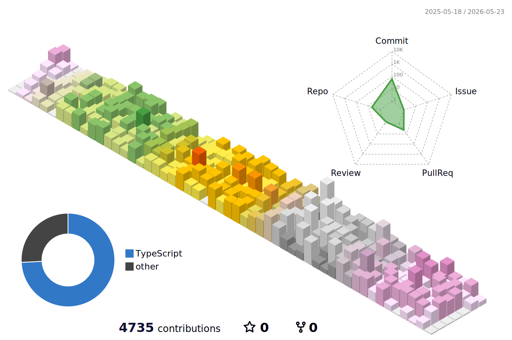
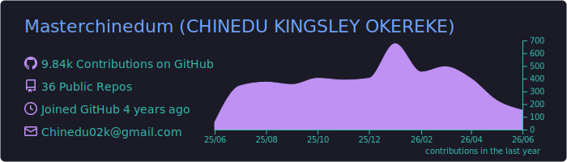
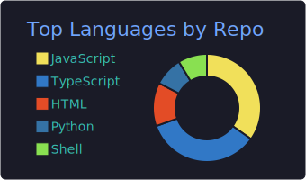
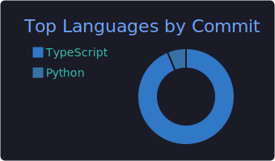
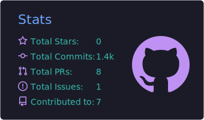
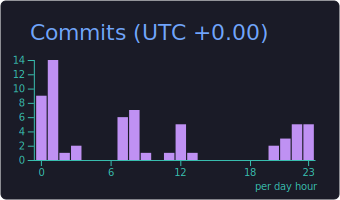

  

  

  
   
  
   
  

 

---

## ⚡ Who I Am

I am a **Full-Stack Software Engineer** focused on building scalable digital systems — from modern SaaS platforms to AI-integrated products and infrastructure-backed applications.

My work is defined by:

- Engineering precision
- Clean system architecture
- Performance at scale
- Business-aligned technical execution

> I design systems that scale with real-world demands.

 

---

## 🛠 What I Build

<table>
  <tr>
    <td align="center" width="50">🌐</td>
    <td><strong>Web Applications & SaaS Platforms</strong> Full-stack platforms built from MVP to production with strong architecture and maintainability.</td>
  </tr>
  <tr>
    <td align="center">🤖</td>
    <td><strong>AI-Integrated Systems</strong> LLM integrations, intelligent automation pipelines, and AI-enhanced product features.</td>
  </tr>
  <tr>
    <td align="center">☁️</td>
    <td><strong>Cloud & Infrastructure</strong> Server configuration, deployment pipelines, scalable APIs, and production-grade environments.</td>
  </tr>
  <tr>
    <td align="center">📊</td>
    <td><strong>Data & Automation</strong> Workflow automation, structured data systems, and performance-driven architecture design.</td>
  </tr>
</table>

 

---

## 🧰 Tech Arsenal

### Frontend

### Backend & APIs

### Cloud & Infrastructure

### CMS & Platforms

 
And other technologies as required by product and infrastructure demands.

 

---

## 🚀 Selected Projects

<table>
  <tr>
    <td width="50%" valign="top">
      <h3>🖥 Laptop Party</h3>
      

        Real-time remote collaboration platform enabling seamless screen sharing and interactive sessions.
        Built for performance, clarity, and production reliability.
      

    </td>
    <td width="50%" valign="top">
      <h3>📊 Socialytica</h3>
      
 Socialytica helps people understand the health, dynamics, Socialytica helps people understand the health, dynamics, and compatibility of romantic and interpersonal relationships by interpreting established psychological tests and patterns.
      

    </td>
  </tr>
</table>

 

---

## 🗺 3D Contribution Calendar

  

 

---

## 📊 GitHub Analytics

  

  
  

  
  
  

 

---

## 📈 Contribution Activity

  

 

---

## 🤝 Let's Build

If you're building something ambitious and need strong engineering execution — let's connect.

  
   
  
   
  

 

  

  <i>"Build systems. Engineer intelligently. Ship relentlessly."</i>

