  

  

  
  &nbsp;
  
  &nbsp;
  

 

---

## `// about`

I'm a **Full-Stack Software Engineer** building scalable digital systems — from modern SaaS platforms to AI-integrated products and infrastructure-backed applications.

My work is defined by engineering precision, clean system architecture, performance at scale, and execution that stays aligned with the business behind the code.

> I design systems that scale with real-world demand.

 

---

## `// what i build`

<table width="100%">
  <tr>
    <td width="50%" valign="top">
      <strong>Web Applications &amp; SaaS Platforms</strong> 
      Full-stack products taken from MVP to production with durable architecture and maintainability.
    </td>
    <td width="50%" valign="top">
      <strong>AI-Integrated Systems</strong> 
      LLM integrations, intelligent automation pipelines, and AI-enhanced product features.
    </td>
  </tr>
  <tr><td colspan="2"> </td></tr>
  <tr>
    <td width="50%" valign="top">
      <strong>Cloud &amp; Infrastructure</strong> 
      Deployment pipelines, scalable APIs, server configuration, and production-grade environments.
    </td>
    <td width="50%" valign="top">
      <strong>Data &amp; Automation</strong> 
      Workflow automation, structured data systems, and performance-driven architecture.
    </td>
  </tr>
</table>

 

---

## `// stack`

**Frontend** 

**Backend &amp; APIs** 

**Cloud &amp; Infrastructure** 

**CMS &amp; Platforms** 

…and whatever else the product and infrastructure demand.

 

---

## `// selected work`

<table width="100%">
  <tr>
    <td width="50%" valign="top">
      <strong>Laptop Party</strong> 
      Real-time remote collaboration platform with seamless screen sharing and interactive sessions — built for performance, clarity, and production reliability.
    </td>
    <td width="50%" valign="top">
      <strong>Socialytica</strong> 
      Helps people understand the health, dynamics, and compatibility of romantic and interpersonal relationships by interpreting established psychological tests and patterns.
    </td>
  </tr>
</table>

 

---

## `// contribution calendar`

  

  <picture>
    <source media="(prefers-color-scheme: dark)" srcset="https://raw.githubusercontent.com/Masterchinedum/Masterchinedum/output/github-contribution-grid-snake-dark.svg" />
    <source media="(prefers-color-scheme: light)" srcset="https://raw.githubusercontent.com/Masterchinedum/Masterchinedum/output/github-contribution-grid-snake.svg" />
    
  </picture>

 

---

## `// analytics`

  

  
  

  
  

  

  

 

---

## `// connect`

If you're building something ambitious and need strong engineering execution, let's talk.

  
  &nbsp;
  
  &nbsp;
  

 

  

