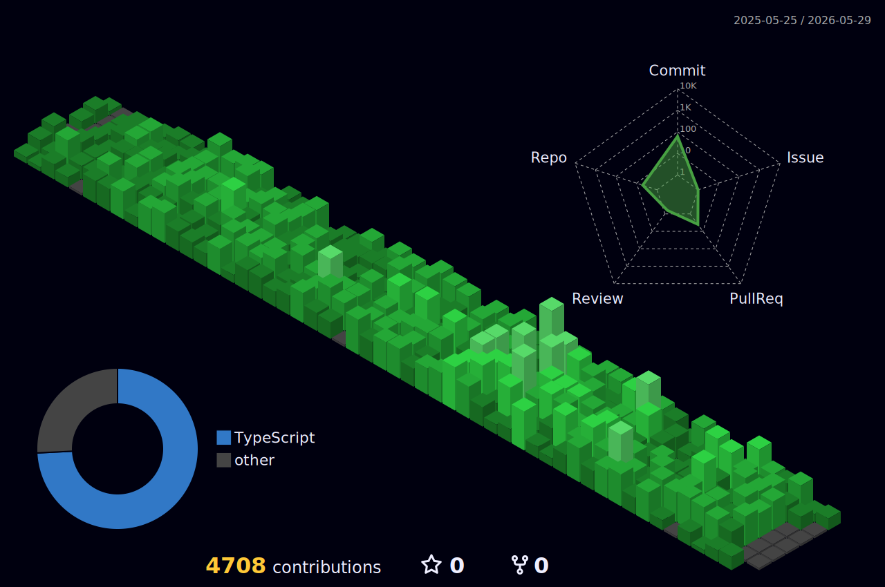
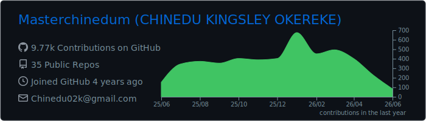
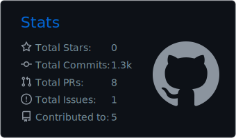
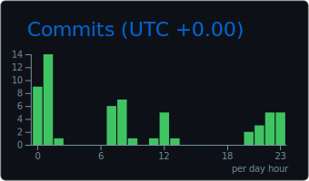
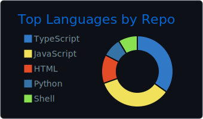
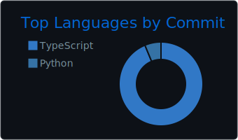

<p align="center">
  
</p>

<p align="center">
  
  &nbsp;
  
  &nbsp;
  
  &nbsp;
  
</p>

<br/>

---

## §00 · SYSTEM OVERVIEW

```
Full-Stack Software Engineer building scalable digital systems — from modern SaaS
platforms to AI-integrated products and infrastructure-backed applications.
```

I treat software like infrastructure: every system is designed for **precision**, **clean architecture**, **performance at scale**, and execution that stays aligned with the business behind the code. From a blank repository to a production deployment serving real traffic — I own the full path.

<br/>

---

## §01 · SUBSYSTEMS

<table width="100%">
  <tr>
    <td width="25%" valign="top"><code>01 · INTERFACE</code></td>
    <td><strong>Web &amp; SaaS Platforms</strong> — full-stack products taken from MVP to production with durable architecture and long-term maintainability.</td>
  </tr>
  <tr>
    <td valign="top"><code>02 · INTELLIGENCE</code></td>
    <td><strong>AI-Integrated Systems</strong> — LLM integrations, intelligent automation pipelines, and AI-enhanced product features.</td>
  </tr>
  <tr>
    <td valign="top"><code>03 · RUNTIME</code></td>
    <td><strong>Cloud &amp; Infrastructure</strong> — deployment pipelines, scalable APIs, server configuration, and production-grade environments.</td>
  </tr>
  <tr>
    <td valign="top"><code>04 · PERSISTENCE</code></td>
    <td><strong>Data &amp; Automation</strong> — workflow automation, structured data systems, and performance-driven architecture.</td>
  </tr>
</table>

<br/>

---

## §02 · BILL OF MATERIALS

| Layer | Components |
| :-- | :-- |
| **Interface** | `Next.js` · `React` · `TypeScript` · `Tailwind CSS` · `shadcn/ui` |
| **Services** | `Node.js` · `NestJS` · `REST APIs` |
| **Persistence** | `PostgreSQL` · `Drizzle` · `Prisma` · `Redis` |
| **Runtime** | `Google Cloud` · `Docker` · `Linux` · `Nginx` |
| **Platforms** | `WordPress` |

<sub>…and whatever else the product and infrastructure demand.</sub>

<br/>

---

## §03 · TELEMETRY

<p align="center">
  
</p>

<p align="center">
  
</p>
<p align="center">
  
  
</p>
<p align="center">
  
  
</p>
<p align="center">
  
</p>
<p align="center">
  
</p>

<br/>

---

## §04 · INTERFACES

```
$ connect --to chinedu --for "ambitious engineering execution"
```

<p align="center">
  <a href="https://chinedu.net">
    
  </a>
  &nbsp;
  <a href="https://linkedin.com/in/masterchinedum">
    
  </a>
  &nbsp;
  <a href="mailto:Chinedu02k@gmail.com">
    
  </a>
</p>

<br/>

<p align="center">
  
</p>
